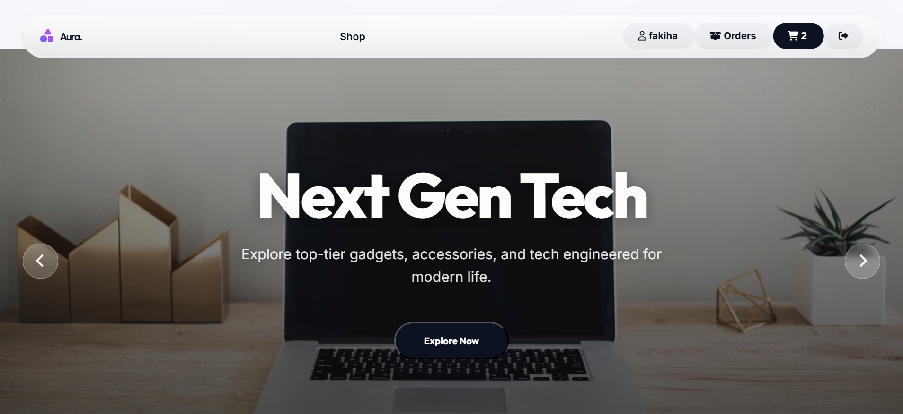
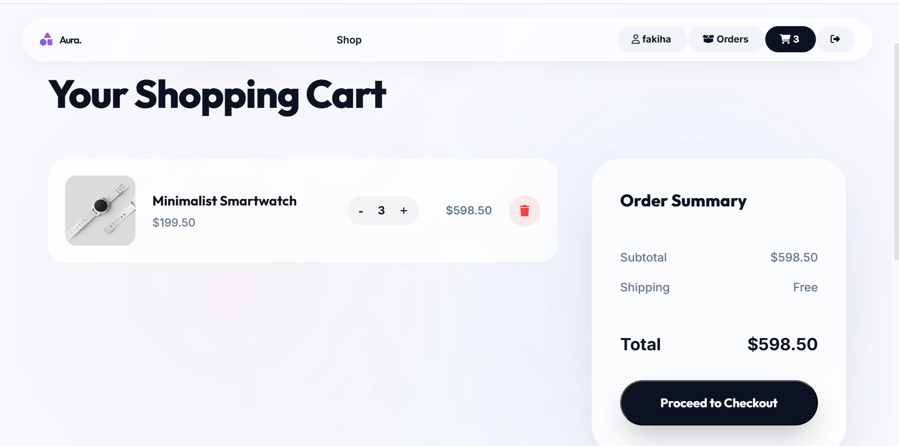
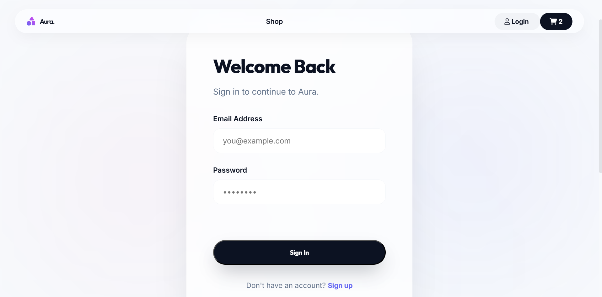

# Aura | Premium E-Commerce 🛍️

Aura is a state-of-the-art, premium e-commerce platform designed with a modern, glassmorphic aesthetic. It provides a seamless shopping experience with a focus on visual excellence and smooth user interactions.



## ✨ Features

- **Premium UI/UX**: Built with a sleek dark theme, vibrant glassmorphism effects, and dynamic background blobs for a high-end feel.
- **Dynamic Hero Slider**: Features a full-screen, automated slider showcasing the latest trends and collections.
- **Product Catalog**: A curated grid of products with real-time dynamic injection from a SQLite database.
- **Product Details**: Dedicated pages for each product with high-resolution imagery and detailed descriptions.
- **Shopping Cart**: Fully functional cart system with subtotal calculations and persistence.
- **User Authentication**: Secure Login and Registration system using JWT (JSON Web Tokens) and password hashing with Bcrypt.
- **Order Management**: Track your shopping history with a dedicated orders view.
- **Fully Responsive**: Optimized for all devices, from high-end desktops to mobile screens.

## 🛠️ Tech Stack

- **Frontend**: HTML5, Vanilla CSS3 (Custom Design System), JavaScript (ES6+).
- **Backend**: Node.js, Express.js.
- **Database**: SQLite3 for lightweight, efficient data management.
- **Security**: JWT for session management, Bcrypt for password encryption.
- **Icons**: FontAwesome 6.

## 📸 Screenshots

### Homepage & Hero Slider


### Product Detailed View


### Authentication (Login)


## 🚀 How to Run Locally

### 1. Prerequisites
Ensure you have [Node.js](https://nodejs.org/) installed on your machine.

### 2. Installation
Clone the repository and install the dependencies:
```bash
npm install
```

### 3. Start the Server
Run the following command to start the backend server:
```bash
node server.js
```
The application will be available at `http://localhost:3000`.

## 📂 Project Structure

- `/public`: Frontend assets including HTML, CSS, and JS.
- `/screenshots`: Visual documentation of the application.
- `server.js`: Express.js server logic and API endpoints.
- `database.js`: SQLite database configuration and initialization.
- `database.sqlite`: Persistent storage for users, products, and orders.

## 📄 License

This project is licensed under the ISC License.

